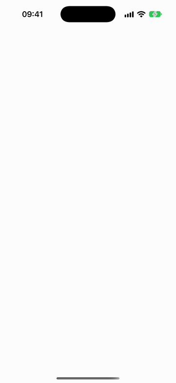
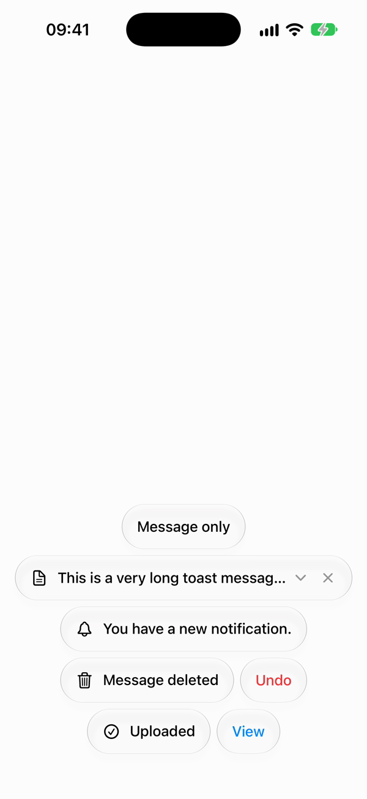

# Toasts

A toast notification library for SwiftUI, built entirely on **Liquid Glass**.

> This is a fork of [sunghyun-k/swiftui-toasts](https://github.com/sunghyun-k/swiftui-toasts) that drops the custom
> background and legacy OS support in favor of the system Liquid Glass material. It requires iOS 26 or later.

<p>
  <picture>
    <source media="(prefers-color-scheme: dark)" srcset="docs/demo-dark.gif">
    
  </picture>
  <picture>
    <source media="(prefers-color-scheme: dark)" srcset="docs/toasts-dark.png">
    
  </picture>
</p>

## Installation

Add the package in Xcode (**File → Add Package Dependencies…**) or in `Package.swift`:

```swift
dependencies: [
  .package(url: "https://github.com/ielyas/swiftui-toasts.git", from: "2.1.0")
]
```

Then add the `Toasts` product to your target.

## Features

- Easy-to-use toast notifications
- Liquid Glass capsules that blur and reflect the content behind them
- Action buttons inside the toast, so each toast is one piece of glass
- Support for custom icons, messages, and buttons
- Long messages get a chevron to expand the toast and read them in full; an expanded toast stays until it's collapsed
  or swiped away
- Seamless integration with SwiftUI
- Adapts automatically to light and dark mode, Reduce Transparency, and Increase Contrast
- Dynamic Type and Reduce Motion support
- Haptic feedback for info, success, warning, and error toasts, timed with the toast's appearance
- Slide gesture to dismiss, an optional close button, and `dismissToast` to dismiss from code
- Loading state interface with async/await
- Full VoiceOver compatibility, with its hints and actions in English and Arabic

## Usage

1. Install toast in your root view:

```swift
import SwiftUI
import Toasts

@main
struct MyApp: App {
  var body: some Scene {
    WindowGroup {
      ContentView()
        .installToast(position: .bottom)
    }
  }
}
```

2. Present a toast:

```swift
@Environment(\.presentToast) var presentToast

Button("Show Toast") {
  let toast = ToastValue(
    icon: Image(systemName: "bell"),
    message: "You have a new notification."
  )
  presentToast(toast)
}
```

## Advanced Usage

```swift
try await presentToast(
  message: "Loading...",
  task: {
    // Handle loading task
    return "Success"
  },
  onSuccess: { result in
    ToastValue(icon: Image(systemName: "checkmark.circle"), message: result, kind: .success)
  },
  onFailure: { error in
    ToastValue(icon: Image(systemName: "xmark.circle"), message: error.localizedDescription, kind: .error)
  }
)
```

## Dismissing

A toast can show a close button inside it. It's off by default:

```swift
presentToast(ToastValue(message: "Tap ✕ to dismiss.", showsDismissButton: true))
```

To dismiss from code, keep the ID `presentToast` returns and pass it to `dismissToast`, or call `dismissToast()` with
no ID to dismiss every toast, loading ones included:

```swift
@Environment(\.presentToast) var presentToast
@Environment(\.dismissToast) var dismissToast

let id = presentToast(ToastValue(message: "Syncing…", duration: 10))
// Later
dismissToast(id)
```

A dismissed toast collapses back into its circle and leaves, just as when its time runs out. With VoiceOver, the close
button is the toast's Dismiss action, and the escape gesture also dismisses it.

## Haptics

Each toast has a `kind` that describes what it communicates. Following Apple's
[haptics guidelines](https://developer.apple.com/design/human-interface-guidelines/playing-haptics), a toast plays the
system haptic whose meaning matches its kind, as the glass circle expands into the toast:

| Kind | Haptic |
| --- | --- |
| `.info` (default) | Soft impact |
| `.success` | Success notification |
| `.warning` | Warning notification |
| `.error` | Error notification |

```swift
presentToast(ToastValue(icon: Image(systemName: "exclamationmark.triangle"), message: "Storage almost full", kind: .warning))
```

Faint taps also mark the motion itself: one as the circle starts sliding in and one as the toast settles, then one as
it starts collapsing and one as it closes into the circle and leaves. Expanding or collapsing a long message taps the
same way as it starts and settles. They're skipped with Reduce Motion on.

A loading toast stays silent while its task runs and plays the haptic of the toast it resolves into, so the feedback
reports the outcome. Haptics follow the System Haptics setting.

## Liquid Glass design

Toasts follow Apple's [Liquid Glass guidance](https://developer.apple.com/documentation/SwiftUI/Applying-Liquid-Glass-to-custom-views):

- Each toast is a capsule with `.glassEffect(.regular.interactive())`, so it reacts to touch while you swipe it away.
- A toast slides in as a glass circle (showing its icon), then expands into the full capsule. When it's dismissed, by
  timer, swipe, close button, or `dismissToast`, it collapses back into the circle before leaving. With Reduce Motion on, toasts simply fade.
- The action button is a small capsule inside the toast, filled with a translucent tint of its color rather than glass,
  so glass is never nested inside glass. The close button sits in a matching untinted circle. When a loading toast
  resolves into one with a button, the capsule widens and the button fades in.
- Each toast has its own `GlassEffectContainer`, and new toasts use the `.materialize` transition, so they appear in
  place instead of morphing out of neighbouring toasts.
- Glass stays untinted. `ToastButton.color` colors the button's label and its capsule, which keeps tint for meaning.
- The loading indicator is the system `ProgressView`.

## Customization

- **Remove icon**

```swift
let toast = ToastValue(
  message: "Message only toast."
)
```

- **Add button**

```swift
let toast = ToastValue(
  message: "Toast with action required.",
  button: ToastButton(title: "Confirm", color: .green, action: {
    // Handle button action
  })
)
```

## Custom SafeArea Handling

If you need to manually control the safe area insets for toasts (e.g., in a custom view hierarchy or when using multiple tabs), you can use the `addToastSafeAreaObserver` modifier:

```swift
struct ContentView: View {
  var body: some View {
    TabView {
      Tab1View()
      Tab2View()
    }
  }
}

struct Tab1View: View {
  var body: some View {
    ScrollView {
      // Your content here
    }
    .addToastSafeAreaObserver()
  }
}
```

This modifier helps the toast system correctly detect and respond to safe area changes, which is particularly useful in complex view hierarchies or when using TabView.

## Requirements

- iOS 26.0+
- Swift 6.2+
- Xcode 26+

## Toasts Lab

`ToastsLab/` is a test app that exercises every variation: content, buttons, durations, loading states, stacking,
sheets, keyboard, multiple hosts, a colorful glass backdrop, and live settings for position, appearance, RTL, and
Dynamic Type. Generate the project with [XcodeGen](https://github.com/yonaskolb/XcodeGen):

```sh
cd ToastsLab && xcodegen generate && open ToastsLab.xcodeproj
```

To run it on a device, copy `ToastsLab/Local.xcconfig.example` to `ToastsLab/Local.xcconfig` and fill in your team
and a bundle ID you can sign; it's gitignored.

Launch with the `-autoplay` argument to present a sample of every toast shape without tapping. `-showcase` does the same over a blank screen, and `-light` or `-dark` forces the appearance; the README media
is recorded that way.

The lab is translated into Arabic, so you can check the toasts in a right-to-left app. Set the app's language to Arabic
in Settings, or launch it with `-AppleLanguages "(ar)"`; the layout follows the language, and the RTL toggle still
overrides it.

## License

MIT. See [LICENSE.md](LICENSE.md).

Based on [swiftui-toasts](https://github.com/sunghyun-k/swiftui-toasts) by Sunghyun Kim.
